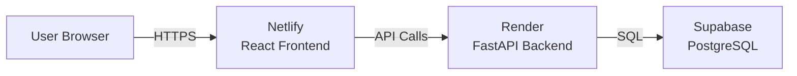
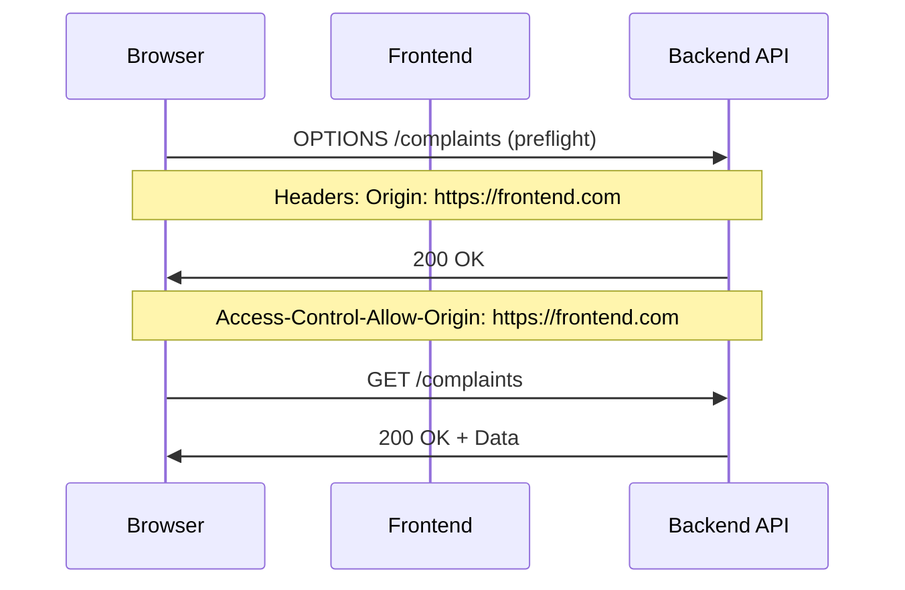

# 🚀 Learning Guide Session 6: Production Deployment

**Topic:** Deploying Full-Stack Applications to Production  
**Prerequisites:** Session 5 (Backend Migration to Supabase)  
**Duration:** ~4 hours of hands-on work  
**Level:** Intermediate → Advanced

---

## 📋 Table of Contents

1. [Overview](#overview)
2. [Architecture & Platform Selection](#architecture--platform-selection)
3. [Frontend Deployment (Netlify)](#frontend-deployment-netlify)
4. [Backend Deployment (Render)](#backend-deployment-render)
5. [CORS Configuration](#cors-configuration)
6. [Connecting Frontend to Backend](#connecting-frontend-to-backend)
7. [Common Issues & Solutions](#common-issues--solutions)
8. [Senior Dev Tips & Tricks](#senior-dev-tips--tricks)
9. [Verification Checklist](#verification-checklist)

---

## Overview

### What You'll Learn

By the end of this session, you'll be able to:

✅ Deploy a React frontend to Netlify  
✅ Deploy a FastAPI backend to Render  
✅ Configure environment variables for production  
✅ Fix CORS issues between frontend and backend  
✅ Troubleshoot common deployment errors  
✅ Debug production issues using logs  
✅ Understand the full deployment workflow

### What We're Building

**Before:** Local development (localhost:5173 → localhost:8000)  
**After:** Production deployment (Netlify → Render → Supabase)



---

## Architecture & Platform Selection

### Platform Comparison

| Platform | Best For | Free Tier | Auto Deploy | Pros | Cons |
|----------|----------|-----------|-------------|------|------|
| **Netlify** | Frontend (React, Vue, etc.) | 100GB/month | ✅ | Fast CDN, easy setup | Limited backend options |
| **Vercel** | Next.js, Frontend | Good | ✅ | Excellent DX | Can be expensive for APIs |
| **Render** | Backend (Python, Node, etc.) | 750hrs/month | ✅ | Full-stack support | Cold starts on free tier |
| **Railway** | Full-stack | $5 credit/month | ✅ | Simple, PostgreSQL included | Smaller free tier |

### 💡 Senior Dev Insight: Why These Platforms?

**Netlify for Frontend:**
- Built specifically for static sites and SPAs
- Global CDN = fast load times worldwide
- Git-based deployments = automatic updates
- Perfect for Vite/React projects

**Render for Backend:**
- Native Python support (no containers needed)
- Auto-detects FastAPI = zero config
- Persistent storage for free tier
- Better for APIs than serverless

**Supabase for Database:**
- Managed PostgreSQL = no maintenance
- Real-time capabilities if needed
- Good free tier (500MB)
- REST API built-in

---

## Frontend Deployment (Netlify)

### Step 1: Prepare Your Frontend

#### Update API URLs to Use Environment Variables

**Problem:** Hardcoded `localhost:8000` URLs won't work in production.

**Solution:** Use Vite environment variables.

**File:** `frontend/src/services/api.js`

```javascript
// ❌ BAD - Hardcoded
const API_BASE_URL = "http://localhost:8000";

// ✅ GOOD - Environment-based
const API_BASE_URL = import.meta.env.VITE_API_URL || "http://localhost:8000";
```

**💡 Senior Dev Tip:** Always provide a fallback for local development!

#### Create `.env.example` for Documentation

```bash
# frontend/.env.example
VITE_API_URL=https://your-backend.onrender.com
```

**Why?** Team members know what variables are needed.

### Step 2: Configure Build Settings

#### Set Node.js Version

**Problem:** Deployment platforms may use incompatible Node versions.

**Solution:** Create `.nvmrc` to pin the version.

**File:** `frontend/.nvmrc`

```
20
```

**File:** `frontend/package.json`

```json
{
  "engines": {
    "node": "20.x"
  }
}
```

**💡 Critical Insight:** Node 22+ can cause vite binary permission issues. Use LTS (20.x).

### Step 3: Deploy to Netlify

1. **Sign up:** https://app.netlify.com
2. **Connect GitHub:** Import your repository
3. **Configure build:**
   - **Root Directory:** `frontend`
   - **Build Command:** `rm -rf node_modules && npm install && npm run build`
   - **Publish Directory:** `frontend/dist`
   - **Node Version:** Automatically detected from `.nvmrc`

4. **Environment Variables:**
   - Key: `VITE_API_URL`
   - Value: `https://your-backend.onrender.com` (we'll set this after backend deployment)

5. **Deploy!**

### Common Frontend Deployment Errors

#### Error 1: "Permission denied: vite"

**Symptoms:**
```
sh: 1: vite: Permission denied
Error: Command "npm run build" exited with 126
```

**Root Cause:** npm install doesn't set execute permissions on binaries in some environments.

**Solution 1 - Force Clean Install:**
```bash
# Build Command
rm -rf node_modules && npm install && npm run build
```

**Solution 2 - Fix Permissions:**
```bash
# Build Command
chmod -R +x node_modules/.bin && npm run build
```

**💡 Senior Dev Wisdom:** When in doubt, clean install. Cache issues cause 80% of weird build errors.

#### Error 2: "Cannot find module 'vite/dist/node/cli.js'"

**Symptoms:**
```
Error [ERR_MODULE_NOT_FOUND]: Cannot find module 
'/opt/build/repo/frontend/node_modules/vite/dist/node/cli.js'
```

**Root Cause:** Corrupted npm cache or incomplete vite installation.

**Solutions:**
1. Delete `package-lock.json` and push
2. Use `rm -rf node_modules` in build command
3. Try `npx vite build` instead of `vite build`

**💡 What NOT to do:** Don't add `vite` to PATH or use custom build scripts. Fix the root cause.

#### Error 3: "Failed to resolve entry for package '@vitejs/plugin-react'"

**Symptoms:**
```
ERROR: Failed to resolve entry for package "@vitejs/plugin-react"
```

**Root Cause:** Using `npx vite build` which downloads vite separately, but your `vite.config.js` imports local dependencies.

**Solution:** Ensure vite and plugins are in `devDependencies`:

```json
{
  "devDependencies": {
    "vite": "^5.4.11",
    "@vitejs/plugin-react": "^4.3.4"
  }
}
```

Use local vite: `"build": "vite build"` NOT `"build": "npx vite build"`

---

## Backend Deployment (Render)

### Step 1: Prepare Backend for Production

#### Update CORS to Use Environment Variables

**Problem:** Hardcoded localhost origins block production frontend.

**File:** `backend/app/main.py`

**Before:**
```python
app.add_middleware(
    CORSMiddleware,
    allow_origins=["http://localhost:5173", "http://localhost:3000"],  # ❌ Only localhost!
    allow_credentials=True,
    allow_methods=["*"],
    allow_headers=["*"],
)
```

**After:**
```python
from app.config import settings

# Get allowed origins from environment variable, fallback to localhost for development
allowed_origins = settings.ALLOWED_ORIGINS.split(",") if settings.ALLOWED_ORIGINS else [
    "http://localhost:5173", 
    "http://localhost:3000",
    "https://your-frontend.netlify.app"  # Production URL
]

print(f"🔧 CORS Allowed Origins: {allowed_origins}")  # Debug log

app.add_middleware(
    CORSMiddleware,
    allow_origins=allowed_origins,
    allow_credentials=True,
    allow_methods=["*"],
    allow_headers=["*"],
)
```

**💡 Senior Dev Pattern:** Always log critical configurations on startup!

#### Update Config to Support ALLOWED_ORIGINS

**File:** `backend/app/config.py`

```python
class Settings:
    # ... other settings ...
    ALLOWED_ORIGINS: str = os.getenv("ALLOWED_ORIGINS", "")
```

**Note:** Store as string, split in main.py. Allows comma-separated list: `url1,url2,url3`

### Step 2: Deploy to Render

1. **Sign up:** https://dashboard.render.com
2. **Create Web Service:**
   - Connect GitHub repository
   - **Root Directory:** `backend` (or leave blank if backend is in root)
   - **Build Command:** Render auto-detects (uses `requirements.txt`)
   - **Start Command:** `uvicorn app.main:app --host 0.0.0.0 --port $PORT`

3. **Environment Variables:**
   ```
   SUPABASE_URL=https://your-project.supabase.co
   SUPABASE_KEY=your-anon-key
   ```
   
   **⚠️ Important:** Do NOT set `ALLOWED_ORIGINS` here initially!

4. **Deploy and wait** (~2-3 minutes for first deploy)

### Step 3: Get Backend URL

After deployment, Render gives you a URL like:
```
https://your-app-name.onrender.com
```

**Save this!** You'll need it for frontend configuration.

### Common Backend Deployment Errors

#### Error 1: Module Import Errors

**Symptoms:**
```
ModuleNotFoundError: No module named 'app'
```

**Root Cause:** Incorrect start command or directory structure.

**Solutions:**
1. Check start command: `uvicorn app.main:app` assumes structure:
   ```
   backend/
   ├── app/
   │   ├── __init__.py
   │   └── main.py
   ```

2. If `main.py` is in backend root: `uvicorn main:app`

**💡 Debugging Tip:** Check Render logs for the exact error and Python path.

#### Error 2: Port Binding Issues

**Symptoms:**
```
[ERROR] Can't bind to '0.0.0.0:8000'
```

**Root Cause:** Not using Render's dynamic `$PORT` variable.

**Solution:**
```bash
# ❌ BAD
uvicorn app.main:app --host 0.0.0.0 --port 8000

# ✅ GOOD
uvicorn app.main:app --host 0.0.0.0 --port $PORT
```

**💡 Platform Awareness:** Every platform (Render, Railway, Heroku) uses different port variables.

---

## CORS Configuration

### Understanding CORS

**What is CORS?**
Cross-Origin Resource Sharing - browser security that blocks requests from different origins.

**Example:**
- Frontend: `https://myapp.netlify.app` (origin)
- Backend: `https://api.onrender.com` (different origin)
- Browser: "Nope! CORS error." ❌

**Solution:** Backend must explicitly allow the frontend origin.

### The CORS Flow



### Common CORS Errors & Fixes

#### Error 1: "CORS error" with no specific message

**Check in DevTools Network Tab:**
- Look at failed request headers
- Check "Origin" header value
- Look at response headers: is `Access-Control-Allow-Origin` present?

**Solutions:**
1. Backend not sending CORS headers → Add CORSMiddleware
2. Wrong origin in backend → Update `allow_origins`
3. Cached response → Hard refresh (Ctrl+Shift+R)

#### Error 2: "access-control-allow-credentials" mismatch

**Symptoms:**
```
The value of the 'Access-Control-Allow-Credentials' header in the response is '' 
which must be 'true' when the request's credentials mode is 'include'.
```

**Solution:**
```python
app.add_middleware(
    CORSMiddleware,
    allow_origins=["https://frontend.com"],
    allow_credentials=True,  # ← Must be True if frontend sends cookies
    allow_methods=["*"],
    allow_headers=["*"],
)
```

#### Error 3: Environment Variable Override

**Problem:** You hardcode Netlify URL in code, but CORS still fails.

**Root Cause:** Environment variable overrides your code!

**Debug Steps:**
1. Add debug logging:
   ```python
   print(f"🔧 CORS Allowed Origins: {allowed_origins}")
   ```

2. Check Render logs after deployment
3. If it shows wrong values, check environment variables in Render dashboard

**💡 Critical Lesson:** Environment variables ALWAYS override code defaults. Check them first!

**Solution:**
- Delete the `ALLOWED_ORIGINS` env var to use code fallback, OR
- Set it correctly: `https://your-frontend.netlify.app` (no trailing slash!)

### Testing CORS

**Method 1: Browser DevTools**
```javascript
// In console on your frontend
fetch('https://your-backend.onrender.com/complaints')
  .then(r => r.json())
  .then(console.log)
```

**Method 2: cURL with Origin Header**
```bash
curl -H "Origin: https://your-frontend.netlify.app" \
     -H "Access-Control-Request-Method: GET" \
     -H "Access-Control-Request-Headers: Content-Type" \
     -X OPTIONS \
     https://your-backend.onrender.com/complaints -v
```

**Look for:** `Access-Control-Allow-Origin` in response headers.

---

## Connecting Frontend to Backend

### Step-by-Step Connection Guide

#### 1. Get Your Backend URL

From Render dashboard: `https://your-app.onrender.com`

#### 2. Set Frontend Environment Variable

**Netlify Dashboard:**
- Site Settings → Environment variables
- Add variable:
  - **Key:** `VITE_API_URL`
  - **Value:** `https://your-app.onrender.com` (⚠️ NO trailing slash!)

**Why no trailing slash?**
```javascript
// With trailing slash:
const url = "https://api.com/" + "/complaints"  // ❌ https://api.com//complaints

// Without trailing slash:
const url = "https://api.com" + "/complaints"   // ✅ https://api.com/complaints
```

#### 3. Redeploy Frontend

After setting env vars, trigger a new deploy:
- Netlify → Deploys → Trigger deploy → "Deploy site"

**💡 Important:** Env vars are embedded during build. Changing them requires redeployment!

#### 4. Update Backend CORS

**Option A: Use Code Fallback (Recommended)**
```python
allowed_origins = settings.ALLOWED_ORIGINS.split(",") if settings.ALLOWED_ORIGINS else [
    "http://localhost:5173",
    "http://localhost:3000",
    "https://your-actual-netlify-url.netlify.app"  # Hardcode for simplicity
]
```

**Option B: Use Environment Variable**
- Set `ALLOWED_ORIGINS` in Render
- Value: `https://your-netlify-url.netlify.app,http://localhost:5173`
- Redeploy backend

#### 5. Verify Connection

**a) Check Network Tab:**
- Open frontend in browser
- DevTools → Network
- Refresh page
- Look for `/complaints` request
- Should show: **Status 200 OK** (not CORS error)

**b) Check Response Headers:**
- Click on the `/complaints` request
- Headers tab
- Response Headers should include:
  ```
  access-control-allow-origin: https://your-netlify-url.netlify.app
  access-control-allow-credentials: true
  ```

**c) Check Console:**
- Should load data, no CORS errors

---

## Common Issues & Solutions

### Issue 1: Double Slash in API URLs

**Symptoms:**
```
GET https://api.com//complaints → 404
```

**Root Cause:** Trailing slash in `VITE_API_URL`.

**Solution:**
```bash
# ❌ BAD
VITE_API_URL=https://api.com/

# ✅ GOOD
VITE_API_URL=https://api.com
```

### Issue 2: Cached Responses (Status 304)

**Symptoms:**
- CORS error persists after fixing backend
- Network tab shows "304 Not Modified"

**Root Cause:** Browser is using cached response from before the fix.

**Solutions:**
1. **Hard refresh:** Ctrl+Shift+R (Windows) or Cmd+Shift+R (Mac)
2. **Clear cache:** DevTools → Application → Clear storage
3. **Disable cache:** DevTools → Network → Check "Disable cache"

**💡 Pro Tip:** Always have "Disable cache" checked while developing!

### Issue 3: Environment Variables Not Updating

**Symptoms:**
- You change `VITE_API_URL` in Netlify but frontend still uses old value

**Root Cause:** Environment variables are embedded at build time, not runtime.

**Solution:**
1. Update env var in Netlify
2. **Trigger new deployment** (don't just redeploy existing build)
3. Wait for build to complete
4. Hard refresh browser

**💡 Understanding Build vs Runtime:**
- **Vite (build time):** `import.meta.env.VITE_API_URL` → Replaced with actual value during build
- **Node.js (runtime):** `process.env.API_URL` → Read when code runs

### Issue 4: Missing Access-Control Headers

**Symptoms:**
- Request succeeds (200 OK) when called directly
- CORS error when called from frontend
- No `access-control-allow-origin` header in response

**Debugging:**
```bash
# Check if CORS headers are present
curl -I https://your-backend.com/complaints \
  -H "Origin: https://your-frontend.com"
```

**Root Cause:** CORSMiddleware not configured or not including the origin.

**Solution:** Check these in order:
1. Is CORSMiddleware added to FastAPI app?
2. Does `allow_origins` include your frontend URL?
3. Are you logging the `allowed_origins`? Check the logs!
4. Is there an environment variable overriding your code?

---

## Senior Dev Tips & Tricks

### Debugging Production Issues

#### 1. Use Structured Logging

```python
# ❌ Print debugging (works but basic)
print("User logged in")

# ✅ Structured logging (production-ready)
import logging
logger = logging.getLogger(__name__)

logger.info("User logged in", extra={
    "user_id": user.id,
    "ip": request.client.host,
    "timestamp": datetime.now()
})
```

**Why?** Searchable, filterable, can send to services like Sentry.

#### 2. Add Health Check Endpoints

```python
@app.get("/health")
async def health_check():
    return {
        "status": "healthy",
        "database": "connected" if await check_db() else "disconnected",
        "timestamp": datetime.now().isoformat()
    }
```

**Use:** Monitoring services, quick status checks, debugging.

#### 3. Environment-Specific Configuration

```python
class Settings:
    DEBUG: bool = os.getenv("DEBUG", "False").lower() == "true"
    
    @property
    def is_production(self):
        return not self.DEBUG
    
    @property
    def log_level(self):
        return "DEBUG" if self.DEBUG else "INFO"
```

**Pattern:** Feature flags based on environment.

### Deployment Best Practices

#### 1. Never Commit Secrets

```bash
# .gitignore
.env
.env.local
.env.production
*.env

# Exceptions (safe to commit)
!.env.example
```

#### 2. Use Different Environments

```
Development → Staging → Production
   ↓            ↓           ↓
localhost    staging.app  app.com
```

**Setup:**
- Netlify: Deploy previews for PRs
- Render: Separate services for staging/prod

#### 3. Rollback Strategy

**Netlify:**
- Deploys → Click old deploy → "Publish deploy"

**Render:**
- Manual deploys → "Rollback" button
- Git-based: Revert commit, push

**💡 Always test before deploying to production!**

### Performance Optimization

#### 1. Enable Compression

FastAPI automatically compresses responses, but verify:

```python
from fastapi.middleware.gzip import GZipMiddleware

app.add_middleware(GZipMiddleware, minimum_size=1000)
```

#### 2. Cache Static Assets

Netlify does this automatically for builds.

For API responses:

```python
from fastapi import Response

@app.get("/complaints")
async def get_complaints(response: Response):
    response.headers["Cache-Control"] = "public, max-age=300"  # 5 minutes
    # ... return data
```

#### 3. Database Connection Pooling

Supabase client handles this by default!

```python
# Already optimized
supabase = create_client(url, key)  # Reuses connections
```

---

## Verification Checklist

Use this checklist to verify successful deployment:

### Frontend (Netlify)

- [ ] Site deploys successfully (green checkmark in Netlify)
- [ ] Build logs show no errors
- [ ] Environment variable `VITE_API_URL` is set correctly
- [ ] Site loads at `https://your-site.netlify.app`
- [ ] No console errors in browser DevTools
- [ ] Hard refresh clears any cached issues

### Backend (Render)

- [ ] Service shows "Live" status
- [ ] Logs show successful startup
- [ ] Debug log shows correct CORS origins
- [ ] Health check endpoint responds: `https://your-backend.com/`
- [ ] API endpoints respond: `https://your-backend.com/complaints`
- [ ] Environment variables set for Supabase

### CORS & Connection

- [ ] Network tab shows 200 OK on API requests (not CORS error)
- [ ] Response headers include `access-control-allow-origin`
- [ ] Response headers include `access-control-allow-credentials: true`
- [ ] Data loads successfully in frontend UI
- [ ] Can create/update/delete via frontend

### Post-Deployment

- [ ] Test on different browsers (Chrome, Firefox)
- [ ] Test on mobile devices
- [ ] Check Render logs for any errors
- [ ] Monitor Supabase usage
- [ ] Set up uptime monitoring (optional: UptimeRobot)

---

## Real-World Scenarios

### Scenario 1: "It works on my machine!"

**Problem:** App works locally but fails in production.

**Common Causes:**
1. Environment variables not set
2. Different Node/Python versions
3. Case-sensitive file paths (local: Windows, prod: Linux)
4. Database connection strings

**Debug Process:**
1. Check deployment logs for exact error
2. Compare local env vars to production
3. Verify versions match (`package.json` engines)
4. Test production URL directly (bypass frontend)

### Scenario 2: Intermittent CORS Errors

**Problem:** CORS works sometimes, fails other times.

**Common Causes:**
1. Multiple deployments with different CORS configs
2. CDN caching old responses
3. Load balancer routing to old instances

**Debug Process:**
1. Check if error is consistent or random
2. Verify all instances have same code (check commit hash in logs)
3. Force cache clear: Add `?v=2` to API URLs temporarily
4. Check for multiple CORS middleware (duplicate)

### Scenario 3: Slow API Responses

**Problem:** API responds in 50ms locally, 3s in production.

**Common Causes:**
1. Cold starts (free tier sleeps after inactivity)
2. Database far from backend server
3. N+1 query problems
4. No connection pooling

**Solutions:**
1. Upgrade to paid tier (no cold starts)
2. Add caching layer (Redis)
3. Optimize database queries
4. Use CDN for static assets

---

## Next Steps

### Immediate Actions

1. **Set up monitoring:**
   - Sentry for error tracking
   - LogRocket for session replay
   - Google Analytics for usage

2. **Configure custom domains:**
   - Buy domain (Namecheap, Google Domains)
   - Configure DNS in Netlify/Render
   - Enable SSL (automatic with both platforms)

3. **Add CI/CD:**
   ```yaml
   # .github/workflows/test.yml
   name: Tests
   on: [push, pull_request]
   jobs:
     test:
       runs-on: ubuntu-latest
       steps:
         - uses: actions/checkout@v2
         - name: Run tests
           run: |
             cd backend
             pip install -r requirements.txt
             pytest
   ```

### Learning Resources

**CORS Deep Dive:**
- https://developer.mozilla.org/en-US/docs/Web/HTTP/CORS
- https://web.dev/cross-origin-resource-sharing/

**FastAPI Deployment:**
- https://fastapi.tiangolo.com/deployment/
- https://render.com/docs/deploy-fastapi

**Vite Deployment:**
- https://vitejs.dev/guide/static-deploy.html
- https://docs.netlify.com/frameworks/vite/

**DevOps Best Practices:**
- The Twelve-Factor App: https://12factor.net/
- Clean Architecture Book
- Site Reliability Engineering Book (Google)

---

## Summary

### Key Takeaways

1. **Environment variables control production behavior** - Always check them first
2. **CORS requires both backend config AND correct origins** - Test thoroughly
3. **Build-time vs runtime** - Understand when env vars are embedded
4. **Debug with logs** - Print critical configs on startup
5. **Cache is your enemy during debugging** - Hard refresh often
6. **Clean installs solve 80% of build issues** - `rm -rf node_modules`

### Skills Acquired

✅ Deploy full-stack apps to production  
✅ Debug CORS issues systematically  
✅ Configure environment variables correctly  
✅ Read and understand deployment logs  
✅ Troubleshoot common deployment errors  
✅ Think like a senior developer (debugging mindset)

### Common Pitfalls to Avoid

❌ Hardcoding URLs in code  
❌ Committing `.env` files  
❌ Ignoring deployment logs  
❌ Not testing after env var changes  
❌ Using bleeding-edge Node versions  
❌ Forgetting trailing slashes in URLs  
❌ Not having a rollback plan

---

## Exercises

### Exercise 1: Deploy a New Feature

1. Add a new endpoint to backend: `/health`
2. Call it from frontend on page load
3. Deploy both frontend and backend
4. Verify it works in production

**Learning Goal:** End-to-end deployment workflow

### Exercise 2: Debug a CORS Error

1. Intentionally break CORS (remove Netlify URL from allowed_origins)
2. Deploy backend
3. Use DevTools to diagnose
4. Fix and verify

**Learning Goal:** CORS debugging skills

### Exercise 3: Environment Variable Practice

1. Add a new feature flag: `ENABLE_ANALYTICS`
2. Use it to conditionally enable code
3. Set it in Render dashboard
4. Verify behavior changes without code changes

**Learning Goal:** Configuration management

---

## Conclusion

Deployment is where theory meets reality. You'll encounter errors not mentioned in tutorials. That's normal and expected.

**Senior Developer Mindset:**
1. Read error messages carefully
2. Check logs systematically
3. Test one change at a time
4. Document what worked (and what didn't)
5. Ask for help when stuck (but try first!)

You're now equipped to deploy and troubleshoot production applications. The real learning happens when things break—embrace it!

**Remember:** Every senior developer has broken production. The difference is they learned from it and built better systems.

---

**Next Session Preview:** Session 7 will cover advanced topics like Redis caching, rate limiting, and scaling strategies.

Good luck! 🚀
